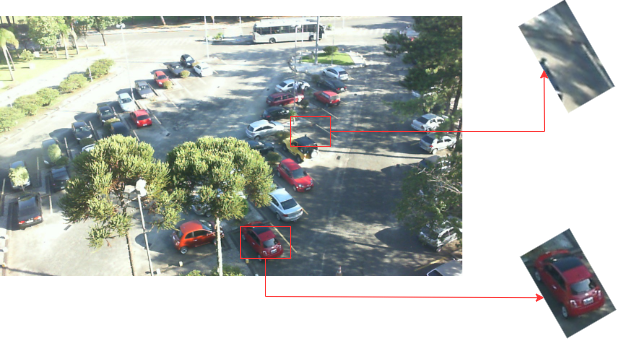

# Parking Space Detection

Yikun Li

Github: [YikunLi9/CASA0018-Parking-Space-Detection (github.com)](https://github.com/YikunLi9/CASA0018-Parking-Space-Detection)

## Introduction
In today's rapidly urbanizing world, parking management has become a critical issue in urban planning. Effective management of parking spaces can not only reduce traffic congestion but also enhance the utilization of parking slots and the energy efficiency of cities. This project aims to develop an intelligent parking system based on machine learning, which will identify the occupancy status of parking spaces in real-time. By providing technological support for parking management, this system will optimize the allocation and utilization of parking resources.

The inspiration for this project came from observing the daily difficulties of parking in cities, especially in commercial and residential areas. Traditional parking management relies on manual inspection, which often results in people spending a lot of time searching for available spaces. By incorporating machine learning technology, this system can automatically analyze data from cameras, instantly determining the availability of each parking spot. This greatly enhances management efficiency and improves the user experience.

To achieve this goal, I have considered current smart parking solutions such as infrared detection, which require extensive sensor deployment in parking lots. While these systems can significantly improve the operational efficiency of parking facilities and customer satisfaction, the deployment costs, especially in large parking lots, are quite high. Therefore, this project will leverage deep learning and computer vision technologies to further enhance the automation and intelligence of parking management, while reducing deployment costs.

## Research Question

In this project, the primary research question revolves around the feasibility and effectiveness of using neural networks to determine the occupancy status of parking spaces. Specifically, the question investigates whether a neural network, particularly a Convolutional Neural Network (CNN), can accurately identify and classify parking spaces as occupied or unoccupied based solely on visual data from images.

## Application Overview
The model for this parking management project is composed of three main parts:

1. **Finding Suitable Third-Party Datasets**: Training for this project requires a substantial dataset, and without access to cameras in parking lots, acquiring large amounts of data can be very time-consuming and challenging.
2. **Model Training and Parameter Tuning**: As mentioned in lectures, the data from the dataset will be divided into a training set, validation set, and testing set in a 60%-20%-20% ratio. During the training process, model parameters such as weights and biases will be continuously adjusted to achieve the best training outcomes.
3. **Model Deployment**: The model will be deployed on a Raspberry Pi 4B, which utilizes an external camera to monitor the parking lot. The device will capture a photo every 30 seconds to detect the occupancy status of parking spaces. Following the detection process, the results will be uploaded to a server via MQTT for display and further use. 

The application diagram and workflow for this project can visualize as follows:

   
   
     

Figure 1: Application Diagram

 

   
   
     

Figure 2: Workflow

 

## Data
The primary data source for this project is the publicly available PKLot dataset provided by the Federal University of Paraná (UFPR) in Brazil (Almeida et al., n.d.). PKLot is a dataset specifically designed for research on parking spot occupancy detection, containing a large number of parking lot images under various weather conditions. It includes images taken on sunny, rainy, and overcast days, offering a rich resource for training and validating machine learning models capable of recognizing parking spot statuses under different conditions.

The PKLot dataset consists of over 12,000 images of parking lots, taken from various angles, with each image meticulously annotated. The annotations include the exact location of parking spots and their occupancy status. Additionally, the dataset provides images of individual parking spaces that have been segmented based on their location. In this project, I utilize these segmented images for training to develop a classification model.

I have extracted images from different parking lots, totaling 4802 images, which include a mix of various weather conditions such as sunny, rainy, and overcast days. This diverse selection aims to cover a broader range of scenarios to enhance the robustness of the model. Below is an example showing one of the images used for training alongside its original location in the parking lot:

   
   
     

Figure 3: Dataset Sample

 

Before training the model, the images underwent enhancement and preprocessing to ensure a robust dataset capable of handling various scenarios. These preprocessing steps included normalization, random rotations, random translations, shear transformations, scaling, and padding.

## Model
In this project, I utilize a Convolutional Neural Network (CNN), a robust type of deep learning model that excels in image recognition tasks. CNNs are particularly adept at processing spatial and hierarchical information in images, which makes them ideal for vision-based tasks like detecting whether parking spaces are occupied.

The model receives a color image with dimensions of 224x224 pixels as input. Its CNN architecture is composed of several convolutional layers followed by pooling layers, which are instrumental in extracting and condensing features from the image. These features range from basic outlines and edges in the initial layers to more complex patterns and textures in deeper layers. After extracting these features, the data is flattened and fed through a series of fully connected layers. To mitigate the risk of overfitting—a common challenge in deep learning—a Dropout layer is incorporated before the final output layer. The output of the model is determined by a single neuron that employs a Sigmoid activation function to produce a probability value. This value indicates the likelihood that a parking space is occupied, with a threshold set at 0.5; values above this threshold suggest the space is occupied, while values below indicate it is unoccupied.

The structure of the model is as follows:

   
   
     

Figure 4: Model Architecture

 

Previously, I attempted to use object detection models like YOLO to train on entire parking lots. However, after multiple trials with unsatisfactory results, I shifted to a simpler yet more accurate classification model.

## Experiments
Due to the initial choice of approach, the first experiments ended in failure. I opted to use the more challenging target detection as the initial approach, but after undergoing multiple lengthy training sessions, the performance of the target detection models was very unsatisfactory:

   
   
     

Figure 5: YOLO Performance

 

The model initially struggled to accurately identify and recognize parking spaces in images of parking lots. After multiple unsuccessful attempts with object detection models, which failed to effectively differentiate between occupied and vacant spots, I shifted to a classification-based approach using a CNN.

During the training process, I conducted experiments with various learning rates, a critical parameter that influences how quickly the model's weights are updated (Albahli et al., 2020). Selecting an appropriate learning rate is essential for ensuring the model converges efficiently and performs effectively. I started with a learning rate of 0.01, but observed that even after 15 epochs of training, the model's accuracy remained stagnant at around 0.5, indicating that it had not yet converged. This lack of improvement led me to reevaluate and ultimately reduce the learning rate to 0.001. With this adjustment, the model began to show promising improvements, demonstrating that a lower learning rate could enhance the stability and accuracy of the training process. After several trials at this new rate, the model's performance in recognizing parking space occupancy noticeably improved, confirming the importance of fine-tuning the learning rate for optimal results, the results were as follows:

   
   
     

Figure 6: Performance in Each Epoch

 

   
   
     

Figure 7: Accuracy Diagram

 

   
   
     

Figure 8: Loss Diagram

 

## Results and Observations
In this project, I explored various methods for detecting whether parking spots were occupied, utilizing both object detection models and convolutional neural networks (CNNs). After experimenting with different techniques, I ultimately developed a successful model based on a CNN. I conducted a series of experiments to optimize the learning rate parameters, finding that a learning rate set too high led to non-convergence in initial training sessions. Conversely, a learning rate of 0.001 was more effective, striking an optimal balance between training speed and model stability.

With additional time, I aim to expand the model further by integrating datasets from various parking lots, enhancing its generalizability across different environments. Exploring more complex network architectures like ResNet or DenseNet could potentially improve performance in scenarios with increased visual obstructions. A more detailed tuning of hyperparameters, such as batch size, choice of optimizer, and regularization strategies, would likely yield even better results.

In conclusion, this project has not only demonstrated the feasibility of using CNNs to detect the occupancy status of parking spots but also highlighted the potential of image recognition technology in managing parking spaces. Moving forward, there is considerable scope to refine this model further. However, exploring models based on object detection could also provide valuable insights and improvements in the field of automated parking management.

## Bibliography
Albahli, S., Alhassan, F., Albattah, W., Khan, R.U., 2020. Handwritten Digit Recognition: Hyperparameters-Based Analysis. Applied Sciences 10, 5988. https://doi.org/10.3390/app10175988

Almeida, P., Oliveira, L.S., Jr, A.S.B., Jr, E.J.S., Koerich, A., n.d. PKLot - A Robust Dataset for Parking Lot Classi cation.

----

## Declaration of Authorship

I, Yikun Li, confirm that the work presented in this assessment is my own. Where information has been derived from other sources, I confirm that this has been indicated in the work.

*Yikun Li*

2024/04/25

Word count:  1451
